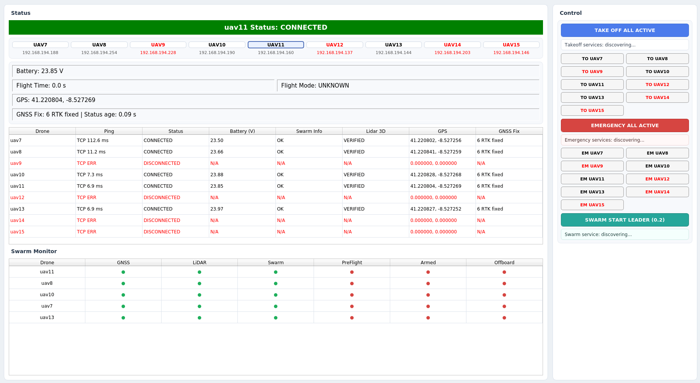

# MRS Openswarm HDI
Scripts and config files related to MRS for human-drone interaction (HDI).

## Real Drone Startup

For real drones, follow these steps:
1. Enter in singularity: `./singularity_poc2/wrapper.sh`
2. `cd singularity_poc2`
3. Type `make cp`

## Drone Dashboard

The dashboard is implemented in:
- `tmux/base_computer/scripts/drone_dashboard.py`

It is launched from the base computer tmux session with:
- `rosrun mrs_openswarm_hdi drone_dashboard.py`

### Scope and drone list

- The dashboard supports drones `uav6` to `uav15`.
- `UAV_NAMES` defines the active swarm subset.
- The first drone in ordered `UAV_NAMES` is considered the swarm leader (used by Swarm Start service).

### Status/Monitoring features

- Live connectivity coloring (red/black) for drone buttons and fleet table rows.
- Connectivity is derived from recent `uav_status` messages and ping/TCP probe results.
- Selected drone telemetry shows battery voltage, flight time, flight mode, GPS, and GNSS fix type.
- Fleet table shows ping, connection state, battery, swarm flag, lidar flag, GPS, and GNSS fix.
- Swarm Monitor section (active drones only) shows LED states for `GNSS`, `LiDAR`, `Swarm`, `PreFlight`, `Armed`, and `Offboard`.

### Topics used

- `/{uav}/uav_manager/diagnostics` (`cur_latitude`, `cur_longitude`, `flight_time`)
- `/{uav}/drone/flight_mode`
- `/{uav}/mrs_uav_status/uav_status`
- `/{uav}/fms/drone_status` with array mapping `0: GNSS`, `1: LiDAR`, `2: Swarm`, `3: PreFlight`, `4: Armed`, `5: Offboard`

### Control features

- Takeoff control: `TAKE OFF ALL ACTIVE` and individual `TO UAVX` buttons via service `/{uav}/uav_manager/takeoff` (`std_srvs/Trigger`).
- Emergency control: `EMERGENCY ALL ACTIVE` and individual `EM UAVX` buttons via service `/{uav}/sweeping_generator/emergency` (`std_srvs/Trigger`).
- Swarm control (leader only): `SWARM START LEADER (0.2)` via service `/{leader}/sweeping_generator/start` (`mrs_msgs/Vec1`) with default request value `0.2`.

### UI behavior

- Service discovery is asynchronous.
- Control buttons are enabled only when the corresponding service is ready.
- Service calls are executed asynchronously to keep the GUI responsive.

# Acknowledgement

Part of the source code in this repository is developed within the frame and for the purpose of the OpenSwarm project. This project has received funding from the European Union's Horizon Europe Framework Programme under Grant Agreement No. 101093046.

